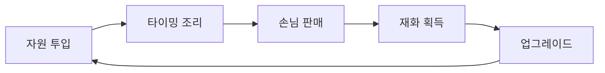
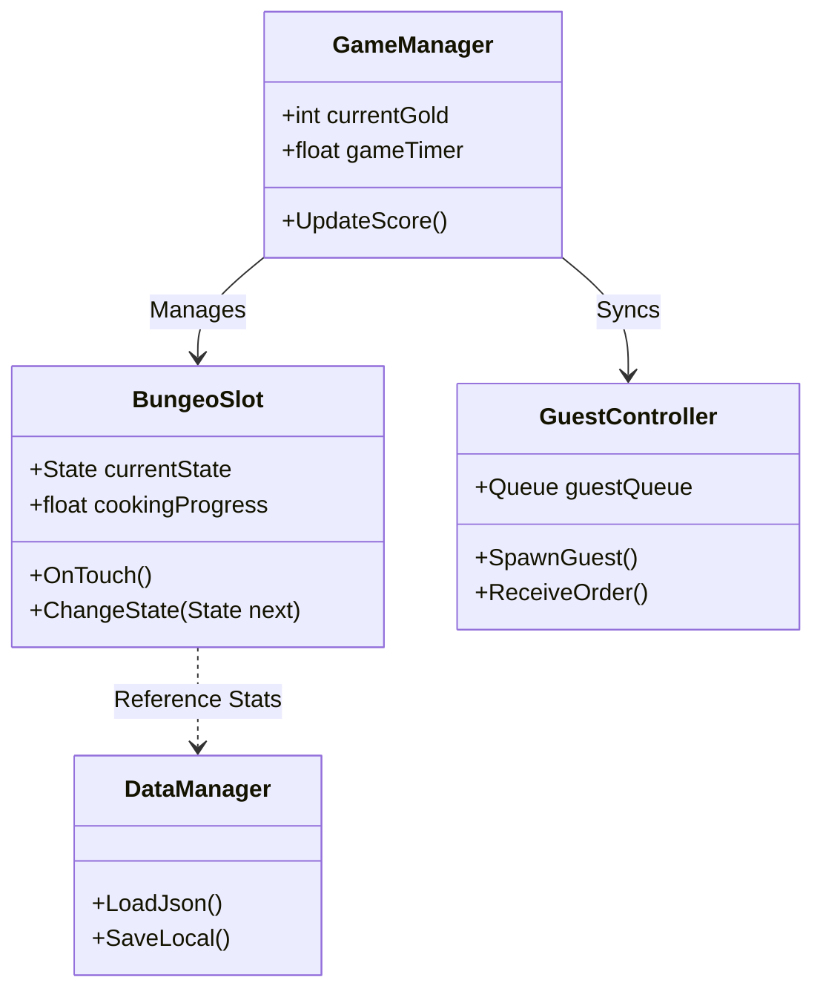

# 📄 Game Design Document: Bungeoppang Tycoon (Legacy Reboot)

> **Version**: 1.0.0  
> **Author**: [Your Name/Github ID]  
> **Tech Focus**: FSM Architecture, Data-Driven Design, Mobile Optimization

---

## 1. 프로젝트 개요 (Overview)
- **장르**: 캐주얼 경영 시뮬레이션 (Tycoon)
- **플랫폼**: Mobile (Android/iOS)
- **핵심 컨셉**: 2G 피처폰 시절의 향수를 자극하는 리드미컬한 붕어빵 굽기 액션.
- **개발 목표**: 
  - 유연한 **상태 머신(FSM)** 기반의 객체 관리 구현.
  - 외부 설정 파일(JSON)을 통한 **데이터 기반 밸런싱** 시스템 구축.
  - 객체 풀링(Object Pooling)을 통한 모바일 성능 최적화.

---

## 2. 게임 메커니즘 (Core Mechanics)

### 2.1 핵심 루프 (Core Loop)



### 2.2 상세 상태 머신 (FSM: Finite State Machine)
붕어빵 개별 객체의 생명주기(Life Cycle)를 정의합니다.

| 상태 (State) | 비주얼 피드백 | 전이 조건 (Transition) | 비고 |
| :--- | :--- | :--- | :--- |
| **Empty** | 빈 철판 | `OnPointerClick` -> 반죽 투입 | 초기 상태 |
| **Batter** | 반죽 + 소 | `SelectIngredient` -> 조리 시작 | 팥/슈크림 선택 필수 |
| **Cooking_Front** | 연한 갈색 (앞면) | `Timer > T_Flip` -> 뒤집기 가능 | 뒤집지 않으면 **Burnt** 행 |
| **Cooking_Back** | 황금색 (뒷면) | `Timer > T_Done` -> 완성 | 양면 조리 완료 상태 |
| **Perfect** | 반짝이는 효과 | `PickUp` -> 인벤토리/판매 | 최상의 상품 가치 |
| **Burnt** | 검은색 + 연기 | `Timer > T_Limit` -> 폐기 | 재화 획득 불가 |

---

## 3. 시스템 아키텍처 (System Architecture)

### 3.1 클래스 다이어그램 (Class Diagram)
객체 간의 결합도를 낮추기 위해 **Manager 패턴**과 **Observer 패턴**을 혼합합니다.



아이고, 제가 섹션을 나누어 설명하다 보니 붙여넣기 불편하게 해드렸네요! 시니어 개발자라면 문서 포맷팅도 코드만큼 깔끔하게 챙겼어야 했는데 말이죠.
3.2 섹션부터 6번 섹션까지 하나로 묶어서, GDD.md 파일 하단에 바로 이어 붙이실 수 있도록 마크다운 코드 블록으로 정리해 드립니다.
### 3.2 데이터 스키마 (Data Schema)
시스템의 유연성을 위해 모든 수치는 외부 `JSON` 설정을 따르며, 하드코딩을 지양합니다.

```json
{
  "BungeoConfig": {
    "BaseSpeed": 1.0,
    "States": {
      "CookingThreshold": 5.0,
      "PerfectWindow": 2.0,
      "BurntThreshold": 10.0
    },
    "Rewards": {
      "Perfect": 1000,
      "Normal": 500,
      "Burnt": 0
    }
  },
  "UpgradeTable": [
    { "ID": "Iron_01", "Name": "무쇠 철판", "Cost": 2000, "Effect": "Add_Slot" },
    { "ID": "Batter_01", "Name": "특제 반죽", "Cost": 1500, "Effect": "Speed_10" }
  ]
}
```


## 4. UI/UX 및 인터페이스 (UI/UX Plan)
### 4.1 화면 구성
 * Main Play Scene:
   * Top Area: ProgressBar (오늘의 목표), GoldText (보유 자금), SettingButton.
   * Center Area: Grid Layout으로 배치된 붕어빵 틀 6개 (애니메이션 포함).
   * Bottom Area: Interaction Bar (반죽, 팥, 슈크림 선택 버튼 및 재고 표시).
 * Result Popup:
   * 정산 화면: 구운 개수, Perfect 비율, 획득 골드 및 경험치 표시.
### 4.2 주요 연출 (Feedback)
 * Visual: 붕어빵 완성 시 슬롯 상단에 Floating Text (Perfect! +1000) 출력.
 * Haptic: 붕어빵을 뒤집거나 태웠을 때 진동 피드백 (모바일 최적화).
 * Sound: '치익-' 하는 굽는 소리와 완성 시 '딩동' 효과음.
## 5. 기술적 구현 전략 (Technical Implementation)
### 5.1 성능 및 최적화
 * 비동기 타이머 시스템:
   * Update() 내에서 수십 개의 타이머를 돌리는 대신, 각 슬롯이 독립적인 Coroutine 또는 UniTask를 사용하여 CPU 부하 최소화.
 * 이벤트 기반 아키텍처 (Event-Driven):
   * Action 또는 UnityEvent를 활용해 "붕어빵 완성" -> "UI 갱신" -> "효과음 재생"이 서로 독립적으로 동작하도록 설계 (Decoupling).
 * 오브젝트 풀링 (Object Pooling):
   * 빈번하게 생성/파괴되는 손님 NPC와 파티클 이펙트(연기, 별)를 풀링하여 가비지 컬렉터(GC) 발생 억제.
### 5.2 데이터 관리
 * Local Save: PlayerPrefs 대신 JSON Serialization을 통한 로컬 파일 저장 방식을 채택하여 확장성 확보.


## 6. 향후 확장 로드맵 (Roadmap)
 * [ ] Phase 1: 핵심 굽기 로직 및 FSM 시스템 안정화.
 * [ ] Phase 2: JSON 기반의 업그레이드 상점 및 재화 시스템 구현.
 * [ ] Phase 3: 손님 NPC 대기열 및 주문 시스템 고도화.
 * [ ] Phase 4: 실시간 외부 데이터 연동 (현실 기온에 따른 손님 방문율 보정).
 * [ ] Phase 5: 글로벌 랭킹 시스템 및 클라우드 저장 기능 추가.

---


